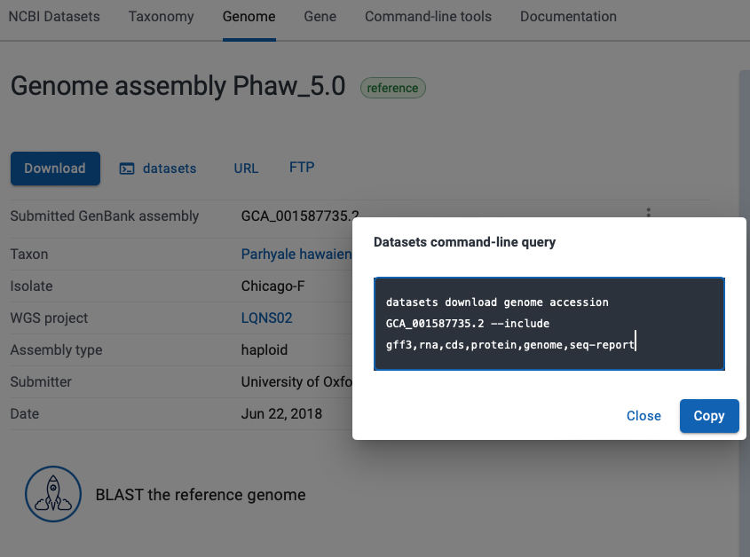

<br>
<br>
## Basic RNAseq pipeline [WORK IN PROGRESS]
<br>
<font size="4">
<details><summary><font size="6"><b>1) About, credits, and other information</b></font></summary>
  <br>
  <br>
  Compiled by: Gavin Gouws and Katy Maher, NERC Environmental Omics Facility, University of Sheffield<br>
  <br>
  
	
  This pipeline is set up to perform the analysis of RNAseq data using standard tools, as introduced in the NEOF
  RNAseq, Differential Gene Expression and Pathway Analysis workshop. Details of the workshops can be found 
  [here](https://neof.org.uk/training/). 

  This pipeline closley follows the approach and workflow developed for the above workshop by Katy Maher, Helen 
  Hipperson, Ewan Harney, Steve Paterson, Bert Overduin, Matthew Gemmell and Xuan Liu. It also relies substantially 
  on scripts developed by Katy Maher. Use and referencing of this repository implicitly acknowledges these contributions.

  The pipeline relies on you having short-read Illumina transcriptomic data for your samples, and access to a 
  published or publically-available reference genome or transcriptome with (preferably) a high level of annotation.

  This protocol has been written for use with the University of Sheffield's
  [BESSEMER](https://docs.hpc.shef.ac.uk/en/latest/bessemer/index.html) HPC system, but should be applicable to 
  any GNU/Linux-based HPC system, with appropriate software installations and modification. Your mileage 
  may vary.

  Code which the user (that's you) must run is highlighted in a code block like this:
  ```
  I am code - you must run me
  ```
  Sometimes the desired output from a command or additional information about the command is included in the code
  block as a comment.
  
  For example:
  ```
  Running this command
  # Should produce this output
  ```

  File-paths within normal text are within single quote marks, like this:

  '/home/user/a_file_path'
  <br><br>
 Contact: Gavin Gouws //  g.gouws@sheffield.ac.uk
  </details>
<br>
<details><summary><font size="6"><b>2) Getting started on the HPC.</b></font></summary>
  <br>
  <br>
  <font size="4"><b>2.1) Access the HPC</b></font>
  <br>
	
  To access the BESSEMER high-performance computer (HPC) you must be connected
  to the university network - this can be achieved remotely by using the
  virtual private network (VPN) service.

  [Please see the university IT pages for details on how to connect to the VPN.](https://students.sheffield.ac.uk/it-services/vpn)

  Once connected to the VPN you also need to connect to the HPC using a secure shell (SSH)
  connection. This can be achieved using the command line on your system (the Mac Terminal or Windows 
  PowerShell) or a software package such as [MobaXterm](https://mobaxterm.mobatek.net/).

  [See the university pages for guidance on how to connect to the VPN](https://docs.hpc.shef.ac.uk/en/latest/hpc/index.html).

  <br>
  <font size="4"><b>2.2) Access a worker node on BESSEMER</b></font>
  <br>
  
  Once you have successfully logged into BESSEMER, you need to access a worker node:

  ```
  srun --pty bash -l
  ```
  You should see that the command prompt has changed from

  ```
  [<user>@bessemer-login2 ~]$
  ```
  to
  ```
  [<user>@bessemer-node001 ~]$
  ```
  ...where \<user\> is your University of Sheffield (UoS) IT username.

  
  <br>
  <font size="4"><b>2.3) Load the Genomics Software Repository</b></font>
  <br>
  
  The Genomics Software Repository contains several pre-loaded pieces of software
  and environments useful for a range of genomics analyses, including this one.
  
  Type:
  
  ```
  source ~/.bash_profile
  ```
  
  Did you receive the following message when you accessed the worker node?
  
  ```
  Your account is set up to use the Genomics Software Repository
  ```

  If so, you are set up and do not need to do the following step.
  If not, enter the following:
  
  ```
  echo -e "if [[ -e '/usr/local/extras/Genomics' ]];\nthen\n\tsource /usr/local/extras/Genomics/.bashrc\nfi" >> $HOME/.bash_profile
  ```
  ...and then re-load your profile:
  
  ```
  source ~/.bash_profile
  ```
  
  Upon re-loading, you should see the message relating to the Genomics Software Repository above.

  
  <br>
  <font size="4"><b>2.4) Set up your conda profile</b></font>
  <br>
  
  If you have never run conda before on the Bessemer, you might have to initialise your conda. To do this type:
  
  ```
  conda init bash
  ```
  
  You will then be asked to reopen your current shell. Log out and then back into Bessemer and then continue. 
  <br>
  
  <br>
  <font size="4"><b>2.5) Accessing the molecolb priority queue/partition</b></font>
  <br>

  
  These scripts are written to launch the jobs using the ___molecolb___ priority queue/partition. Contact one of the
  NEOF Bioinformatics Team to check whether you have or to grant you access. You could also use the general 
  ***sheffield*** partition. One of the team will gladly give you instructions for modifying the submission scripts
  to do this.
  <br>

  <br>
  <font size="4"><b>2.6) Running scripts on the HPC cluster</b></font>
  <br>
  
  To add our job to the job scheduler, we would submit the shell scripts using 'sbatch'
  (don't do this; it's simply an example).

  ```
  ## EXAMPLE - DON'T RUN
  sbatch scripts/example_script.sh
  ```

  We could then view the job that we have submitted to the job queue using 'squeue'.

  ```
  squeue --me
  ```

  The job will then receive the allocated resources, the task will run, and the appropriate output files generated 
  (inlcuding output and error logs). In the following workflow, the output from a particular step is the input for 
  the next step. **IMPORTANT:** You'll need to wait for each job to finish before submitting the next. It is also
  **important** to check the error and output logs after each step/job (before launching the next job) to see whether 
  it has completed properly or if there were issues or failures.
  
  You should also keep in mind that the resources (the number of cores, memory and time) requested in the scripts 
  may not be suitable for your own data set and analysis (or another HPC, if you are not using Bessemer), and may 
  need to be changed. Again, the NEOF Bioinformatics Team can help in setting these in the scripts.


  <br>
  <font size="4"><b>2.6) Passing command line arguments to a script</b></font>
  <br>

  As well as running the standardised scripts there are some parameters which will be unique to your project or data. 
  For example, these might be your file extensions, the name of your reference genome or the filtering parameters you
  want to implement for QC.<br>
  <br>

  To run a script with these extra parameters (termed 'arguments') we supply them on the command line with a 'flag'.
  For example, you might supply your genome file name to a script using the '-g' flag as

  ```
  a_demo_script.sh -g my_orgamism.fa
  ```
  </details>
  <br>

  <details><summary><font size="6"><b>3) Load data and access scripts</b></font></summary>
  <br>
  <br>
  <font size="4"><b>3.1) Create a working directory and load your data</b></font>
  <br>
  
  You should work in the directory '/fastdata' on BESSEMER as this allows shared access to your files, scripts,
  and output and error logs, all of which are useful for troubleshooting.<br>
  <br>

  Check if you already have a directory in '/fastdata' by running the command exactly as it appears below.

  ```
  ls /fastdata/$USER
  ```

  If you receive the message
  ```
  ls: cannot access /fastdata/<user>: No such file or directory
  ```
  you'll need to create a new folder in '/fastdata' using the command exactly as it appears below:

  ```
  mkdir -m 0755 /fastdata/$USER
  ```

  You'll now need to create a new subdirectory in which you will do all your work. It is called 'my_project' in the
  commands below, but you are welcome to name it as you see fit. You'll then need to create a subdirectory within 
  'my_project', called 'raw_data', to receive your data. All other subirectories needed will be created when running
  the scripts. Create this directory structure as follows:
  
  ```
  mkdir /fastdata/$USER/my_project
  mkdir /fastdata/$USER/my_project/raw_data
  ```
  <br>
  <font size="4"><b>3.2) Required data inputs</b></font>
  <br>

  For this workflow, you'll need to provide your raw, paired-end transcriptomic/RNA sequence data and a reference
  genome or transcriptome to align this data to. You'll also need the annotation data/files for your genome or
  transcriptome.
  <br>
  <br>
  <font size="4"><b>3.3) Load required RNA sequence data onto the HPC</b></font>
  <br>
  
  If you have generated the data through NEOF, the NEOF team will download and archive your data as soon as 
  it is released by the Centre for Genomic Research (CGR) at the University of Liverpool. You will need to copy your 
  data into your 'raw_data' folder. The command will be similar to that below - a member of the NEOF Bioinformatics
  Team will give you the precise location of your data for copying:<br>
  <br>

  ```
  cp -r /fastdata/bi1gg_shared/your_project_data/* /fastdata/$USER/my_project/raw_data/
  # The source directory is an example; the precise location will be provided
  ```
  
  If you have downloaded your (or other) data to your personal computer, you'll need to transfer this to the HPC. 
  You can download the data generated through NEOF using the links ('wget' links) and resources that CGR provide. 
  Please be sure that you download the raw data. Links will be provided to download trimmed data, but since you 
  will be doing your own QC, you'll have greater flexibility when you have access to the raw data. To transfer data 
  to the HPC, you can use a file transfer protocol, such as 'scp', the upload feature in MobaXTerm or a tool such
  as [FileZilla](https://filezilla-project.org/). Be sure that you upload the data to '/fastdata/$USER/my_project/raw_data'.


  Run 'ls' on your 'raw_data' folder and you should see something like the following
  
  ```
  ls /fastdata/$USER/my_project_raw_data
  # sample1_R1_001.fq.gz
  # sample1_R2_001.fq.gz
  # sample2_R1_001.fq.gz
  # sample2_R2_001.fq.gz
  ```
  
  Make sure that you have removed any '.tar.gz' or '.zip' files and any files that contain improperly demultiplexed data. 
  These may be labelled 'unclassified' (e.g., 'Unclassified_R1', 'Unclassified_R2') or be indicated as 'R0' reads. 
  <br>

  The workflow assumes that the '/fastdata/<user>my_project/raw_data' directory contains sequence data that are:

  * Paired (two files per biological sample)
  * Demultiplexed
  * In FASTQ format
  * In the compressed '.gz' format (optional, but recommended)

  <br>
  <b><font size="4">3.4) Copy the analysis scripts</b></font>
  <br>
  Clone this GitHub repository and then copy the 'scripts' folder into your '/fastdata/$USER/my_project'
  folder. You can then delete the GitHub download.

  ```
  git clone https://github.com/ggouws/HPC_RNAseq
  cp -r HPC_RNAseq/scripts /fastdata/$USER/my_project/
  rm -rf HPC_RNAseq
  ```
  </details>
  <br>
  
 
 <details><summary><font size="6"><b>4)  Download reference genome or transcriptome</b></font></summary>
 <br>
  <br>
  
  Now that we have set up the HPC and have our data, we need to source and add the reference genome 
  or transcriptome. 
  <br>

  Remember that all scripts are launched from and work is done in our primary working directory 
  ('/fastdata/$USER/my_project'), so you'll need to navigate there when logging on to Bessemer and prior
  to launching any scripts.

  ```
cd /fastdata/$USER/my_project
```
  
  If the reference genome or transcriptome you intend to use is available on NCBI, we will use the 
  '01_reference_download.sh' script to download it. This script creates a directory ('reference') 
  in '/fastdata/$USER/my_project' in which to place the reference genome/transcriptome, uses the 
  NCBI-datasets tool to download it, unpacks the downloaded '.zip' file and tidies the output, 
  leaving the genome/transcriptome ('.fna' or 'fasta' file) and the annotation ('.gff' or 'gff3') 
  file.
  <br>

  To run this script, we will supply the following command-line argument:
  - the NCBI-datasets download link for your genome/transcriptome (-L)
  <br><br>
  This is available by following the "datasets" tab (the second tab) on the NCBI genome page of the record or
  accession that you are interested in. The command-line query can then be copied from the pop-up window and
  pasted after the '-L' flag in the job submission as below.



    
  ``` 
 sbatch scripts/01_reference_download.sh \
 -L "Insert copied NCBI-datasets command-line query here within quotation marks"
  ```
 
 When the script has finished running, the genome/transcriptome and annotation files will be in your 'reference'
 directory. 
 
 
 If you have downloaded your reference genome/transcriptome differently or have it downloaded to your
 personal computer, you will need to transfer it to the HPC, using one of the approaches discussed above. You will
 need to create a 'reference' directory first and be sure to place your reference and annotation data in there. 
 
  ``` 
  mkdir reference
  ```


 </details>
  <br>
 <details><summary><font size="6"><b>5)  Quality assessment, quality control and data trimming</b></font></summary>
  <br>
  <br>
  <font size="4"><b>5.1) Raw data quality assessment</b></font>
  <br>
 
  Our first analytical tasks are to investigate the quality of our sequence data and the fastq files, and then perform
  quality filtering and trimming, such that high quality data remain for mapping and quantifying.
  
  Firstly, you'll need to run the script to generate the quality plots of the raw data. This script
  runs [fastQC](https://www.bioinformatics.babraham.ac.uk/projects/fastqc/) on each sample separately. The script then 
  uses [MultiQC](https://multiqc.info) to combine the fastQC reports for the individual samples into a combined quality 
  plot (in 'html' format), which you can download and view in a browser.<br>
  <br>
  
  <b>The command line arguments you must supply are:</b><br>
  - the file extension for your R1 reads (-F)
  - the file extension for your R2 reads (-R)
  <br><br>
  
   <br>
  
  
  ```   
 sbatch scripts/02_raw_fastqc.sh -F _R1.fastq.gz -R _R2.fastq.gz
  ``` 
  
  <br>

Once the script has finished running, the fastQC output will be in a 'raw_fastqc' folder. The MultiQC reports will 
be placed in a folder called 'quality_reports', which you can download to view the contents in a browser. There will 
be two MultiQC plots, one for the R1 reads for all your samples ('Raw_data_R1_multiqc_report.html') and one for the
R2 reads (Raw_data_R2_multiqc_report.html). View and consider these reports when considering your strategy for cleaning 
(filtering and trimming) your data.

  
For most data sets, you'll likely see:

- The quality decreases towards the end of the reads
- The R2 reads have poorer quality than the R1 reads
- The read sizes have a range compared to all being one size. However, most of the reads are towards the long end of the range.

Generally, even if data is looking good we would carry out quality control to get rid of any poor data that is masked
by the very good data and to remove any adapter sequences. In the next step, we'll carry out quality control on our fastq files.
<br>
<br>
<font size="4"><b>5.2) QC: Filtering and trimming</b></font>
<br>
  
Quality control generally comes in two forms:

1. **Trimming**: This is directly cutting off bits of sequence. This is typical in the form of trimming off low quality bases from the end of reads and trimming off adapters at the start of reads.
2. **Filtering**: This occurs when entire reads are removed. A typical occurrence of this is when a read is too short and we do not want reads below a certain length.

To carry this out, we will use [Trimmomatic](http://www.usadellab.org/cms/index.php?page=trimmomatic).

  
<br>
To run Trimmomatic we will use the '03_trimmomatic.sh' script. This has many optional parameters you can use for filtering and trimming your data. 
By default this script assumes you have paired end data and the the quality is encoded using *phred33* (typical for most Illumina data).
<br>

<b>The command line arguments you must supply are:</b><br>
  
  - the file extension for your R1 reads (-F)
  - the file extension for your R2 reads (-R)
  <br><br>
  
<b>Optionally, you can also supply:</b><br>
  
  - parameters for ILLUMINACLIP (-K).
  - parameters for SLIDINGWINDOW (-S)
  - parameters for LEADING (-L)
  - parameters for TRAILING (-T)
  - parameters for CROP (-C)
  - parameters for HEADCROP (-H)
  - parameters for MINLEN (-M) 
<br><br>

More details of the optional parameters can be found below or in the Trimmomatic [manual](http://www.usadellab.org/cms/index.php?page=trimmomatic)
  
  - ILLUMINACLIP: These settings are used to find and remove Illumina adapters. First, a fasta file of known adapter sequences is given, followed by the number of mismatches allowed between the adapter and read sequence and then thresholds for how accurate the alignment is between the adapter and read sequence. The fasta file of adapter sequences ('TruSeq3-PE-2.fa') is provided in your downloaded 'scripts' folder.
  - SLIDINGWINDOW: This specifies to scan the read quality over a 4 bp window, cutting when the average quality drops below the specified phred score.
  - LEADING: The minimum quality value required to keep a base at the start of the read.
  - TRAILING: The minimum quality value required to keep a base at the end of the read.
  - CROP: Cut the read to a specified length.
  - HEADCROP: Cut the specified number of bases from the start of the read.
  - MINLEN: This specifies the minimum length of a read to keep; any reads shorter than the specified length are discarded.
    <br><br>
An example of how to run Trimmomatic can be found below. The parameters provided are fairly standard quality thresholds. You are welcome to try these,
evaluate how your data are filtered and then consider other parameters.
 
<br><br>
 
 ```   
 sbatch scripts/03_trimmomatic.sh -F _R1.fastq.gz -R _R2.fastq.gz \
 -K ILLUMINACLIP:scripts/TruSeq3-PE-2.fa:2:30:10 \
 -S SLIDINGWINDOW:4:30 \
 -M MINLEN:50 \
 -L LEADING:3 \
 -T TRAILING:3
 ``` 
<br>
When the script has finished running the trimmed data will be in a 'trimmed' folder. Each sample will have now be represented by four files. There will 
be paired R1 and R2 read files, for the R1 and R2 reads that remained paired after filtering and trimming, and unpaired R1 and R2 files for those R1 
and R2 reads, where only one of the pair remained after filtering. For our analyses, we will use the reads that are still paired.<br> 

<br>
<br>
<font size="4"><b>5.3) Trimmed data quality assessment</b></font>
<br>
 
Now that we have run Trimmomatic, we can check how successful our quality control has been by running fastQC and MultiQC on the 
cleaned data, as per the command below:<br>
<br> 

```   
sbatch scripts/04_clean_fastqc.sh
```   
<br><br>

When the script is finished running, the fastQC output and reports will be in a 'clean_fastqc' folder. The two MultiQC html reports
('Clean_data_R1_multiqc_report.html' and 'Clean_data_R2_multiqc-report.html') will be in the 'quality_reports' folder for you to 
download and examine.

If you are satisfied with the quality and amount of data (number of reads) retained, you can proceed with your analysis.
If not, you can return to the Trimmomatic step, changing the parameters and repeating the quality control.
  
  </details>
  <br>
  
 <details><summary><font size="6"><b>6) Align short reads to the reference genome/transcriptome</b></font></summary>
  <br>
  <br>  
 
 We are now ready to map our cleaned reads to our reference genome or transcriptome. To do this, we will use 
 [HISAT2](http://daehwankimlab.github.io/hisat2/manual/). HISAT2 is a fast and memory-efficient alignment tool, and - 
 importantly for RNAseq work - it is a "splice aware" aligner. This means that it can map reads from transcriptomic 
 sequencing over the exon-intron junctions in a genome. Many common alignment tools are not "splice aware" and cannot
 accommodate these exon-intron junctions. As such, these tools will only be suitable for mapping our sequence reads
 against a transcriptome (rather than a genome).<br>

 
The script below will index the genome we downloaded earlier and will then map our paired and trimmed reads from
Trimmomatic to the reference. 

 
  <br>
  <b>You'll need to provide two arguments in your command line when launching the script:</b><br>
  
  - the accession number of your reference genome/transcriptome (-A)<br>
  - the extension (e.g., 'fna' or 'fasta' of your reference genome/transcriptome (-X)<br>
  
  The accession number need not be complete, but should be informative (unique) enough to identify your specific 
  reference if you have multiple potential references in your 'reference' folder. Be careful when using hyphens 
  (-) and underscores (_).
   <br><br>
  
   <br>
 
  ```   
 sbatch scripts/05_reference_align.sh -A GCA_017639245 -X fna.gz
  ```  
  

HISAT2 will align your reads, and output the aligned results for each sample in SAM (Sequence Alignment Map format).
This output is piped to SAMtools, a programme for writing, viewing and manipulating alignment files, which sorts them
and generates a BAM file (a compressed, binary version of the SAM file). These sorted BAM files are found in a folder
called 'aligned'. HISAT2 will also generate (using the '--met-file' function) a report and mapping statistics for each
sample ('_sample_name_.stats') in the 'aligned' folder. The script also uses the 'flagstat' function of SAMtools to generate
a mapping quality report ('initial_mapping_quality'), which you can find in the 'quality_reports' folder. This file will
contain the mapping statistics for all samples, with the sample names appearing before the tables of statistics. 

We can view the latter report as such (press `q` to exit this view when done):

  
  ```
  less quality_reports/initial_mapping_quality
  ```
   
  <br><br>
We need to consider how many of our reads have been mapped and how many of these have been mapped in pairs (i.e., the
R1 and R2 reads have both properly mapped), as this is the data we will proceed with. If the mapping quality is poor
and data are lost, we may need to consider alternative reference genomes or transcriptomes (if available), revisit the
QC of our data or possibly adjust our mapping parameters.


  </details>
  <br>
 
   
 <details><summary><font size="6"><b>7)  Clean aligned BAM files</b></font></summary>
  <br>
  <br>    
If we are satisfied with the quality of our mapping, we will now proceed to clean up our BAM files. We will use
SAMtools to exclude:

  
  - Reads that were not mapped at all
  - Reads that were not mapped properly in pairs (i.e., one read was mapped and the other not)
  
SAMtools will use the 'flagstat' [flags] to identify and include reads that were mapped in pairs ('-f 2') and to exlcude reads 
that weren't mapped or weren't mapped in pairs ('-F 12').

To clean our aligned files, we will submit the script as below (no additional arguments are needed).
  <br><br>

  
  ```
  sbatch scripts/06_align_clean.sh
  ```
   
  <br><br>
  
The script will create the cleaned BAM files ('_sample_prefix_.clean.bam') for each sample and place them in an
'aligned_clean' folder. It will also use SAMtools 'flagstat' to produce a mapping report ('final_mapping_quality')
in the 'quality_reports' folder. This will hold the reports for all of your samples. Upon viewing it, we should
hopefully see that all of the reads we have retained are properly mapped in pairs.

  
  ```
  less quality_reports/final_mapping_quality
  ```
   
  <br><br>

If so, we can now proceed to quantifying our transcriptomic reads!

  </details>
  <br>
  
 <details><summary><font size="6"><b>8) Counting reads</b></font></summary>
  <br>
  <br>   
   
  We will now use [htseq-count](https://htseq.readthedocs.io/en/release_0.11.1/count.html) to 
  quantify/count our transcripts (reads) for the various genes or exons. For this, we need to be sure
  that we have the annotation file ('.gff', '.gff3' or '.gtf' file) in our 'reference' directory. The
  more detailed the annotation, the better.
  
  <br>
  
  The command line further below includes various arguments, which will need to be considered:
  
  <br> 
  
  If your genome file is gzipped we first need to unzip this as samtools faidx does not work with gzipped files.
  <br> 
  - -A: The start of the accession number or file name of your genome/transcriptome annotation file. As with the
    mapping step above, you only need to provide enough information to distinguish this file from other annotation
    files that may be in your 'reference' folder.
  - -X: The file extension of the genome/transcriptome annotation file.
  - -m: This determines how the software will deal with reads that overlap more than one feature (e.g., straddling
    introns or mapping to multiple genes). The options available are "union" (the most commonly used mode; for
    reads spanning an intron), "intersection-strict" and "intersection-nonempty". There is a useful illustration
    [here](https://htseq.readthedocs.io/en/release_0.11.1/count.html) to show the use and effect of the different modes.
  - -s: Whether the data are stranded ("yes") or not ("no"). This refers to whether your data/sequence reads are in a
    particular orientation. There is more information [here](https://chipster.csc.fi/manual/library-type-summary.html).
    This will depend on your library preparation.
  - -t: The feature type that you want to quantify, typically genes ("gene") or exons ("exon"). The features that can be
    quantified are named in the third column of your ('.gff') annotation file.
  - -i: The GFF attribute that you want to use as a feature ID. This is what is used to identify the counts in the tables
    that are produced. If multiple GFF lines have the same ID, they will be considered as being part of the same feature.
    As such, a high resolution annotation is desirable. 
  - -r: This specifies whether the aligned BAM files are sorted by alignment position ("pos") or by read name ("name").
    The preceding scripts sort the files by position, but you may have data that have been sorted by name. 
  <>
The script will be launched as such:
  <br>  
  <br> 
  
  ``` 
  sbatch scripts/07_htseq-count.sh \
  -A GCA_017639245 \
  -X gff \
  -m union \
  -s yes \
  -t gene \
  -i ID \
  -r pos
  ``` 
  
  <br>  
    
  <b> You must supply the command line with:</b><br>
  - the name of your reference genome (-g)
  <br><br>
  
  We then use bcftools mpileup  using the following parameter options:
  - Ou: ouput an uncompressed bam file. This is the option to use when piping the output to another command for optimum performance/speed.
  - --max-depth 10000: the maximum number of sequences considered per position
  - -P ILLUMINA: use Illumina platform for indels
  - -a FORMAT/DP,FORMAT/AD: output depth and allelic depth
  <br><br>
  <b>The command line argument you must specify are:</b><br>
  - filter out alignments with mapping quality < the quality specified (-a)
  - filter out bases with QS < the quality specified (-b)
  <br><br>
 The results from mpileup are then piped to call and we use the following options.
  - -m: use the multiallelic caller
  - -v: output variants only 
  - -f GQ: output genotype quality
  - -O z: output in compressed VCF format
   <br><br>
  <b>The command line argument you must supply is:</b><br>
  - the name you want to call your VCF (-o)
   <br><br>
  
   <br>
 
  ```  
 qsub scripts/08_call_snps.sh -g GCA_017639245.1_MMon_1.0_genomic.fna -o monkparakeet -a 20 -b 20
  ```   
  <br>
  When this script has finished running you should have a vcf file in your 'vcf' folder. 
  
  </details>
  <br>
  
 <details><summary><font size="6"><b>8) NEXT STEP</b></font></summary>
  <br>
  <br>    
 <b> The next step is to clean the VCF so we retain only high quality SNP sites we can be confident in. The script applies the following filters:</b>
 <br><br>  
  
 - Only biallelic SNPs are retained. 
 - It removes SNPs that are less than 250 bp from the start or end of a contig or chromosome.
 - It removes SNPs informed by less than a user specified number of reads, quality threshold and genotyped for less than a specified number of individuals.
 - Users pick a minimum allele frequency (MAF) below which variants will be removed, as these ones are difficult to tell apart from sequencing errors.
 - Sites are removed if the average genotype depth (across individuals) is greater than X times the average genotype depth (considering all sites), where X is a user specified number number.
 - To keep only the most diverse SNP sites we also filter to keep only sites which have called at least one individual that is homozygous for the reference, one that is homozygous for the alternate and one heterozygous individual.
 - Sites are removed if they are highly correlated and adjacent to one another, based on a user-defined correlation coefficient and sliding window length.
  
  The user then specifies how many SNPs they want to randomly extract from the VCF to take forward for primer design.
  <br><br>  
  
 <b> You must supply the command line with the 10 following parameters:</b>
 <br>
  
 - (-o) the name you want to call your VCF, this should match the name you specified in the previous step,
 - (-g) the name of the genome which was used to align the data,
 - (-r) minimum depth needed to retain a SNP site,
 - (-q) the minimum quality threshold for a SNP to be retained (all SNPs with a lower quality score will be excluded,
 - (-i) the minimum number of individuals typed to retain a SNP,
 - (-m) the minimum allele frequency,
 - (-a) a multiplier; sites will be excluded when the average genotype depth (per site) is more than this number times greater than the average genotype depth (considering all sites),
 - (-c) the correlation coefficient R2; sites with an R2 above this value (within a certain window) will be removed, 
 - (-w) the window for assessing correlation between sites; it can be set to a number of sites with an interger alone, or base pairs by adding bp, kb, or Mb after an integer (without any space),
 - (-n) number of SNPs to subsample for primer design; it is advisiable to extract more (up to a third more) than will ultimately be needed for the final genotyping,
  <br>
  <br>
  
  ```
  qsub scripts/09_filter_vcf.sh -o monkparakeet -g GCA_017639245.1_MMon_1.0_genomic.fna \
  -r 3 -q 20 -i 3 \
  -m 0.3 \
  -a 2 \
  -c 0.2 -w 5kb \
  -n 108 
  ```
  <br>
  Intermediate filtering files will be written to your 'vcf' folder and final files for primer design will be in a folder titled 'primer_design'.
  <br>
  
  <br>
  We recommend looking at the output log ('09_filter_vcf.out.log'). Following each filter, an explanation of the filter, a file name and the total number of remaining SNPs are printed to the log, providing an indication of drop out at each stage. We expect to see a fairly large reduction in the number of SNPs at most stages, but after the final filter (eexclusion of correlated adjacent SNPs) there will hopefully still be several thousand SNPs to choose from. 
  <br>
  
  <br>
  If the number of SNPs following filtering is less than the subsampling number (-n), subsampling will fail. The log file will produce an error indicating this. If the number of SNPs following filtering is less than two times greater than the subsampling number (-n), subsampling will proceed, but the output log will give a warning and suggest that the user should inspect drop out and relax some filters. The error file (09_filter_vcf.err.log) may provide further information if troubleshooting is required.
  
  
  </details>
  <br>    
 
 
 <details><summary><font size="6"><b>9) NEXT STEP </b></font></summary>
  <br>
  <br>    
  
  We are now ready to prepare the file needed for primer design for the Fluidigm D3 design portal. The D3 User Guide Instructions can be downloaded [here](https://d3.standardbio.com/account/login).
  
  <br> 
  
  To make the files you need [R](https://www.r-project.org) and [R Studio](https://posit.co/download/rstudio-desktop/) installed on your computer. 
  
  <br> 
  
  Once these are installed download the two files in the 'primer_design' directory onto your computer and the script '10_make_primer_file.R'.
  You can then use the '10_make_primer_file.R' script to make the final output file for SNP design. 
  <br>
  
  Follow the instructions contained in the R script to update the names of your files. 
  <br> 
  
  You should now be ready to submit the final file for primer design.
  
  </details>
  <br>  
 
 <details><summary><font size="6"><b>10) NEXT STEP</b></font></summary>
  <br>
  <br>  
    
   First make an account for the [D3 design portal](https://d3.standardbio.com/account/login).
   
   <br> 
   I recommend you read through the D3 User Guide you downloaded in the previous step. The key steps are summarised below.
   
   - Log into your account on the D3 portal 
   - click `+ NEW PANEL`
   - `SNP Type™ Assays - for SNP genotyping` -> `NEXT`
   - `New Panel` -> `NEXT`
   - `Others (Others - none - none)` -> `NEXT`
   - `No SNP Masking` -> `NEXT`
   - `Panel Properties - Panel Name`: Give your panel a sensible name -> `FINISH`
   - Click `FILE UPLOAD` -> `DOWNLOAD TEMPLATE`
   - Open the downloaded file in excel and select the tab at the bottom titled `Targets by Sequence`. Add the name and sequence details from the file you generated in R in the step above to this tab and then save this tab as a text file.
   - Back on the `FILE UPLOAD` page -> `choose file` and select the file you just saved
   - Click `IMPORT`
   - Select the tick box at the top left next to 'Target' column and then click `SUBMIT FOR DESIGN`
 <br><br>   
 
 Once submitted you will get an email when the primers are designed. 
 <br>
 
 On the `REVIEW DESIGN` tab you now archive any targets that failed primer design ('Not Designable'), 'Nonstandard', or are surplus to your required number of SNPs.
 
 To do this check the blue tick box to the left of the 'Targets' you wish to remove and then click archive. 
 
 When you are happy with the sites you have selected click on the QUOTE button in the top right.
 - `PLATE LAYOUT` -> `Default`
 - `REQUEST QUOTE`
 - Leave `Promotion Code\Blanket PO#` and `Comments` fields blank
 - `Volume (SNP Type)` -> click the dropdown menu and select the volume of primer you want to order 
 - Click `REQUEST QUOTE`.
 
 <br>
 
 You will then get an email when your quote is ready and can proceed to order. Please talk to/email Rachel Tucker (r.tucker@sheffield.ac.uk) for help with ordering.
